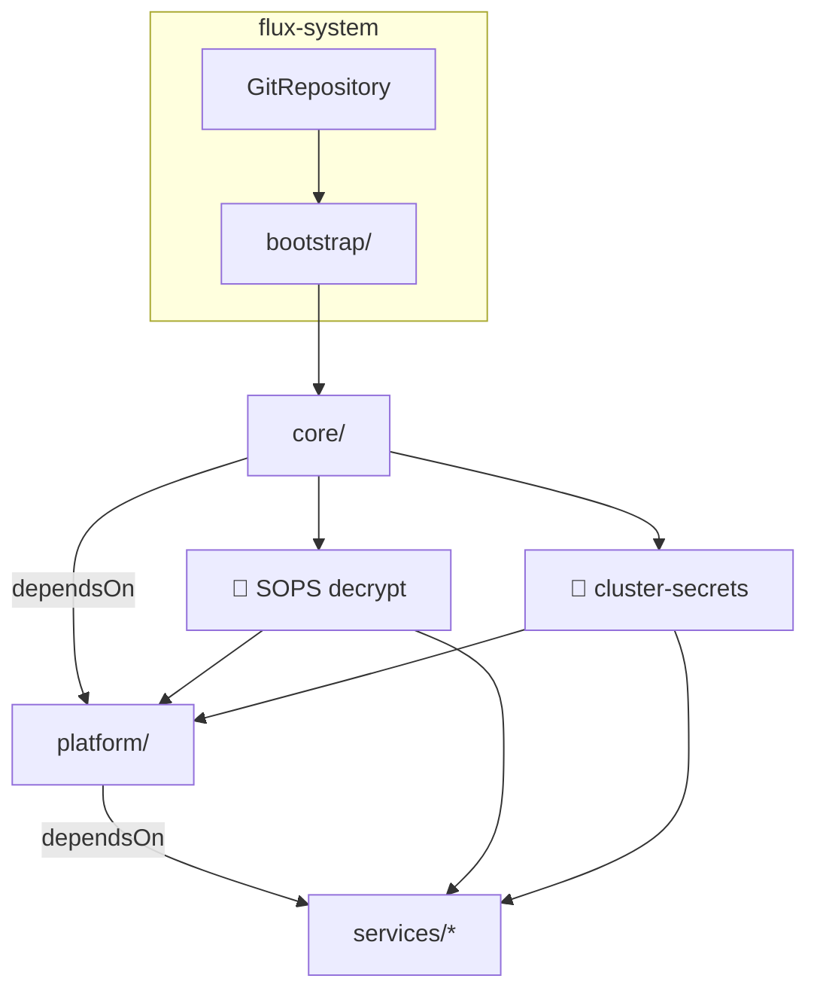

# 🏠 k8s-gitops

<p align="center">
  
  
  
  
  
</p>

<p align="center"><i>GitOps-driven homelab — push to <code>main</code>, Flux handles the rest. No CI pipelines, no manual <code>kubectl apply</code>.</i></p>

---

## 🧱 Architecture

Flux watches this repo and reconciles in **four ordered layers** connected by explicit `dependsOn` chains. Each layer builds on the one before it — infrastructure lands first, then shared platform services, then workloads.



### ① `core/` — Cluster Foundation

| Component | Role |
|-----------|------|
| **cert-manager** | TLS certificate automation |
| **Longhorn** | Distributed block storage |
| **MetalLB** | Bare-metal load balancing |
| **Kyverno** | Policy engine + admission control |
| **k8tz** | Timezone injection for CronJobs |
| **reloader** | Auto-restart on ConfigMap/Secret changes |
| **Crossplane** | Cloud resource provisioning |
| **external-snapshotter** | CSI snapshot support |
| **CloudNativePG** | PostgreSQL operator |
| **Dragonfly** | In-cluster container registry cache |
| **Grafana operator** | Dashboard-as-code |
| **Strimzi** | Kafka operator |

### ② `platform/` — Shared Services

| Service | What it provides |
|---------|-----------------|
| **PostgreSQL 18** | HA Postgres via CloudNativePG |
| **Kafka** | Event streaming via Strimzi |
| **Garage** | S3-compatible object storage |
| **Envoy Gateway** | Kubernetes Gateway API ingress |
| **Prometheus + Grafana** | Metrics, dashboards, alerting |
| **Loki + Promtail** | Log aggregation |
| **Pocket ID** | OIDC identity provider |
| **Velero** | Cluster backup + disaster recovery |
| **ExternalDNS** | Internal (AdGuard) + public (Cloudflare) DNS |
| **Crossplane providers** | DigitalOcean resource provisioning |

### ③ `services/<group>/` — Workloads

| Group | Apps |
|-------|------|
| 🤖 `automation/` | Home Assistant, Frigate NVR, Z-Wave JS, Hermes Agent, Signal CLI |
| 💻 `development/` | Forgejo (self-hosted Git) |
| 🔧 `general/` | Vaultwarden, Actual Budget |
| 📷 `immich/` | Immich photo management |
| 🎬 `media/` | Plex, Sonarr, Radarr, SABnzbd, ErsatzTV |

> ⚠️ All layers use `prune: false` — removing a file from git does **not** delete the cluster resource.

---

## 🔐 Secrets

Secrets never touch the repo in plaintext. The stack is **SOPS** (PGP) + **Flux variable substitution**:

| File | Purpose |
|------|---------|
| `config/secrets.yaml` | Encrypted `cluster-secrets` with all `${VARIABLES}` |
| `platform/garage/s3-keys.yaml` | Encrypted Garage S3 credentials |

Manifests use `${CLUSTER_DOMAIN}`, `${LOAD_BALANCER_*}`, `${POSTGRES_ADDRESS}`, etc. — Flux resolves them at apply time from `cluster-secrets`. Two helper scripts make key management painless:

```sh
scripts/cluster-secrets set|get|list|remove <KEY>
scripts/garage-creds add|list|show|remove <name>
```

No `.env` files, no Base64 secrets committed to git. Everything encrypted at rest.

---

## 🎯 Conventions

- **One file per app** — PVC, HelmRelease, and all extras in a single YAML. Add to the directory's `kustomization.yaml`.
- **bjw-s app-template** — Most workloads use the community [`app-template`](https://github.com/bjw-s/helm-charts) chart. The pattern: `controllers` → `containers` → `service` → `route` → `persistence`.
- **Gateway API** — `route:` blocks (not Ingress) with Gateway API parent refs. Modern, portable, no annotations.
- **Digest-pinned images** — [Renovate](https://docs.renovatebot.com/) bumps versions. No hand-editing image tags.
- **Conventional commits** — `feat(area):`, `fix(area):`, `chore(deps):`.
- **Schema comments** — Every YAML opens with `# yaml-language-server: $schema=...` for IDE support.

---

## 🛠️ Day-to-Day

```sh
# Validate before committing
kubectl kustomize core/

# Force Flux to pick up changes now
flux reconcile kustomization <name> --with-source

# What's stuck?
flux get kustomizations
flux get helmreleases -A

# Edit encrypted secrets
sops config/secrets.yaml
```

---

## 🖥️ Node Provisioning

Node-level OS config lives in `config/ubuntu/` — kernel modules, sysctl tweaks — applied with `config/ubuntu/apply.sh`. Cluster provisioning uses [k0sctl](https://docs.k0sproject.io/) with `config/cluster.yaml`.